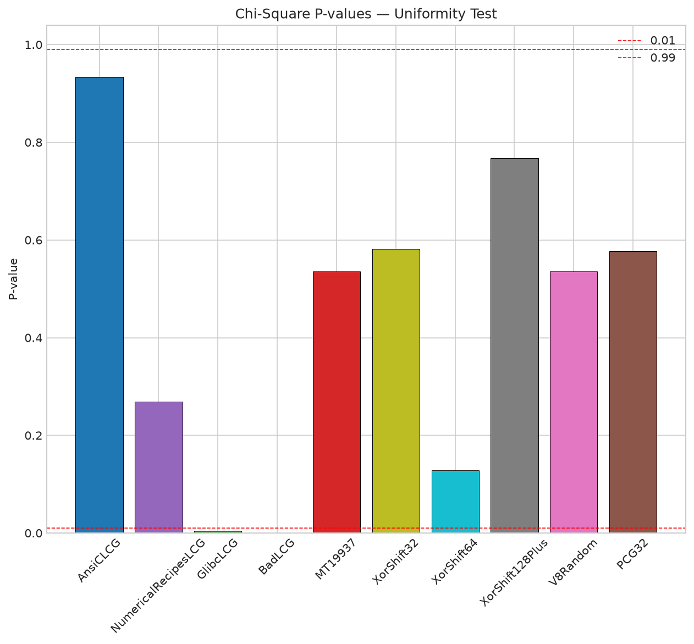

# PRNG Analysis — Pseudorandom Number Generator Research Toolkit

Deterministic, reproducible analysis of ten pseudorandom number generators (PRNGs): statistical testing, state-recovery attacks, and throughput benchmarking behind a single orchestrated CLI, with an auto-generated markdown report.

[](https://www.python.org/downloads/)
[](tests/)
[](LICENSE)
[](requirements.txt)
[](requirements.txt)



---

## Table of Contents

- [Introduction](#introduction)
- [Tech Stack](#tech-stack)
- [Project Structure](#project-structure)
- [Quick Start](#quick-start)
- [Installation](#installation)
- [Usage / CLI Reference](#usage--cli-reference)
- [Methodology](#methodology)
- [Results Summary](#results-summary)
- [Reproducibility](#reproducibility)
- [Testing](#testing)
- [Limitations](#limitations)
- [Dependencies](#dependencies)
- [Recommendations / Next Steps](#recommendations--next-steps)
- [Contributing & Support](#contributing--support)
- [License](#license)
- [Acknowledgements](#acknowledgements)

---

## Introduction

PRNGs power simulations, games, statistics, and cryptography — but how trustworthy is a given generator? This PRNG analysis toolkit answers that question with hard evidence. It implements ten well-known generators from scratch (bit-exact where a reference exists), subjects each one to classical statistical tests (chi-square, autocorrelation, spectral lattice, runs, histograms), attacks the vulnerable ones to recover their internal state from observed outputs, and benchmarks throughput. The entire pipeline runs from a single command and produces a self-contained report.

Target audience: **developers, researchers, and cryptography/statistics enthusiasts** who want to see, reproducibly, which generators behave and which are broken — and why.

Key features:

- **10 PRNG implementations** — ANSI C LCG, Numerical Recipes LCG, glibc `rand()` (upper-15-bit LCG), an intentionally weak LCG (`m=101`), MT19937 (CPython-bit-identical), xorshift32, xorshift64, xorshift128+ (V8's algorithm), V8 `Math.random`, and PCG32.
- **5 statistical tests** — chi-square goodness-of-fit, lag autocorrelation, 2D spectral lattice inspection, bit-0 Wald-Wolfowitz runs test, and value histograms — all with structured pass/fail results plus visualization plots.
- **4 attack families** — LCG parameter recovery (known and unknown modulus), MT19937 full state recovery + prediction, the xorshift family (32-bit brute-force via numba-JIT, 64-bit GF(2) recovery), and V8 xorshift128+ SMT solving via z3.
- **Throughput benchmarking** — clean per-generator ops/s measurement, repeated for stability, with a `builtin_random` (C) baseline for Python-vs-C comparison.
- **One-command orchestration** — `python -m src.main --stage all` runs everything and writes `docs/report.md` with embedded figures.

> [!NOTE]
> This is a research/education toolkit, not a cryptographically secure RNG library. Its purpose is to demonstrate *why* classic generators fail, quantitatively.

## Tech Stack

| Category | Technologies |
|----------|--------------|
| Language | Python 3.10+ |
| Numerical computing | NumPy, SciPy (`stats.chi2`, `stats.norm`) |
| Visualization | Matplotlib |
| JIT acceleration | Numba (xorshift32 brute-force attack) |
| SMT solving | z3-solver (V8 xorshift128+ attack, optional) |
| Orchestration | stdlib `argparse`, `json`, `pathlib` |
| Testing | pytest (134 tests) |

## Project Structure

```text
prng-analysis/
├── src/
│   ├── main.py                  # CLI orchestration (--stage generate/test/attack/benchmark/report/all)
│   ├── report.py                # auto-generates docs/report.md from saved results + figures
│   ├── benchmarks.py            # throughput benchmarking helpers
│   ├── generators/              # 10 PRNG implementations
│   │   ├── base.py              # shared PRNG interface (next_int / next_float / generate)
│   │   ├── lcg.py               # ANSI C, Numerical Recipes, glibc (upper-15-bit), "bad" m=101
│   │   ├── mt19937.py           # Mersenne Twister, bit-identical to CPython random
│   │   ├── xorshift.py          # xorshift32 / xorshift64 / xorshift128+
│   │   ├── v8_random.py         # V8 Math.random (xorshift128+ + 53-bit float)
│   │   └── pcg.py               # PCG32 (XSH-RR)
│   ├── tests/
│   │   ├── statistical_tests.py # chi-square, autocorrelation, spectral, runs, histogram
│   │   └── visualization.py     # Matplotlib plot generation
│   └── attacks/
│       ├── lcg_attack.py        # LCG parameter recovery (known/unknown modulus)
│       ├── mt19937_attack.py    # untempering + state recovery + prediction
│       └── xorshift_attack.py   # brute-force xorshift32, GF(2) xorshift64, z3 xorshift128+
├── tests/                       # pytest suite (134 tests across 14 test files)
├── docs/
│   ├── report.md                # AUTO-GENERATED report (rebuild with --stage report)
│   ├── figures/                 # PNG figures embedded in the report
│   └── specs/                   # per-stage specifications (stage-1 … stage-6)
├── results/                     # generated artifacts: metrics.json, attacks.json,
│                                #   benchmark.json, *.npz, figures/ (gitignored)
├── requirements.txt
└── README.md
```

## Quick Start

**Option A — full pipeline (recommended).** Clones the repo, installs dependencies, and runs every stage end-to-end:

```bash
git clone <your-repo-url> prng-analysis
cd prng-analysis
python3 -m venv .venv && source .venv/bin/activate
pip install -r requirements.txt
python -m src.main --stage all
```

The run writes `results/metrics.json`, `results/attacks.json`, `results/benchmark.json`, and figures, then rebuilds `docs/report.md`.

**Option B — report-only.** If a previous run already produced `results/`, regenerate just the markdown report:

```bash
python -m src.main --stage report
```

**Option C — smoke test.** Verify the pipeline end-to-end with tiny sample sizes (fast, CI-friendly):

```bash
python -m src.main --stage all --n 100000 --n-spectral 10000 --n-bench 100000
```

---

## Installation

**Prerequisites:** Python 3.10 or newer, pip, and a virtual environment (recommended).

```bash
git clone <your-repo-url> prng-analysis
cd prng-analysis
python3 -m venv .venv
source .venv/bin/activate        # Windows: .venv\Scripts\activate
pip install --upgrade pip
pip install -r requirements.txt
```

> [!TIP]
> `z3-solver` is listed in `requirements.txt` but is optional at **runtime**: the code imports it defensively and the V8 xorshift128+ attack degrades gracefully (records `recoverable: false` with a note) if z3 is absent. To skip it, install everything except z3:
> ```bash
> grep -v z3 requirements.txt | pip install -r /dev/stdin
> ```

## Usage / CLI Reference

The CLI entry point is `src/main.py`, runnable as a module:

```bash
python -m src.main --help
```

### Arguments

| Argument | Type | Default | Description |
|----------|------|---------|-------------|
| `--stage` | `generate` \| `test` \| `attack` \| `benchmark` \| `report` \| `all` | `all` | Which stage(s) to run. |
| `--seed` | `int` | `42` | Global seed for reproducibility. |
| `--n` | `int` | `1_000_000` | Number of values for statistical tests. |
| `--n-spectral` | `int` | `100_000` | Number of pairs for the spectral test. |
| `--n-bench` | `int` | `10_000_000` | Number of values for the benchmark. |
| `--results-dir` | `str` | `results` | Output directory for JSON/state artifacts. |
| `--figures-dir` | `str` | `results/figures` | Output directory for generated figures. |

### Stages

| Stage | Actions |
|-------|---------|
| `generate` | Instantiate all generators and persist sequences (`results/generated_sequences.npz`). |
| `test` | Run all statistical tests and render plots → `results/metrics.json` + figures. |
| `attack` | Run LCG / MT19937 / xorshift attacks → `results/attacks.json`. |
| `benchmark` | Measure throughput per generator → `results/benchmark.json` + `benchmark.png`. |
| `report` | Rebuild `docs/report.md` from saved results, copying figures to `docs/figures/`. |
| `all` | Run `generate → test → attack → benchmark → report` in order. |

All output directories are created if missing. The report command is also exposed as its own module entry point:

```bash
python -m src.report
```

## Methodology

All generators expose a uniform interface (`seed`, `next_int`, `next_float`, `generate`) so every test and attack is generator-agnostic. Statistical tests run on `n = 1,000,000` values (default) drawn from a single seeded stream; each numeric output is normalized to `[0, 1)` by dividing by that generator's real output-domain width (e.g. `2^31` for the ANSI C LCG, `2^15` for glibc's 15-bit output, `2^64` for V8).

### Statistical tests

**Chi-square goodness-of-fit.** Bins normalized values into 1,000 equal bins and compares observed counts against the uniform expectation:

$$
\chi^2 = \sum_{i=1}^{k} \frac{(O_i - E_i)^2}{E_i}, \qquad E_i = \frac{n}{k}
$$

The p-value comes from `scipy.stats.chi2.sf(χ², df=k-1)`; the test passes when `0.01 ≤ p ≤ 0.99` (only gross departures fail).

**Autocorrelation.** Computes Pearson correlation at lags 1, 2, 5, 10 on the raw integers (scale-invariant, so no normalization needed). The 95% acceptance band per lag is `±2/√(n-lag)`; the test passes only if every lag is inside it.

**Spectral test.** Plots consecutive normalized pairs `(X_n, X_{n+1})` for 100,000 points. A good generator fills the unit square; a bad LCG shows parallel lattice lines. This is a **visual** test — `passed` is always `True`, the plot is the verdict.

**Runs test.** Converts each value to its least-significant bit and runs the Wald-Wolfowitz runs test, comparing the observed number of runs to the Bernoulli expectation via the Z statistic. |Z| ≥ 1.96 fails. This is deliberately harsh on LCGs: for an odd-increment LCG the low bit alternates, producing an enormous |Z| — the exact weakness glibc's upper-bit extraction exists to avoid.

**Histogram.** Simple visualization of the value distribution (200 bins), used alongside the spectral plot.

### Attacks

- **LCG, known modulus.** From three consecutive outputs and a known `m`, solves the linear system for `(a, c)` and verifies on a further observation. Verified at 100% accuracy for `AnsiCLCG` (`a=1103515245`, `c=12345`).
- **LCG, unknown modulus.** Recovers `m` as the GCD of successive differences, then recovers `(a, c)`. Verified at 100% accuracy for `BadLCG` (`m=101`, `a=3`, `c=7`).
- **MT19937.** Observes 624 consecutive 32-bit outputs, inverts the tempering to reconstruct the 624-word state vector, then predicts all future outputs at 100% accuracy.
- **xorshift32.** Numba-JITted brute force over the 32-bit state space; 100% accuracy.
- **xorshift64.** Recovers the 64-bit state via GF(2) algebra on 64 consecutive outputs; 100% accuracy.
- **V8 xorshift128+.** Recovers both 64-bit internal states with the z3 SMT solver. When z3 is unavailable, the attack records `recoverable: false` with an explanatory note instead of crashing.

### Benchmark

Each generator emits `n_bench` outputs in a tight loop; timing is repeated 3× with the median reported as outputs/second. `builtin_random` (CPython's C `random.getrandbits`) provides the C baseline for the Python-vs-C gap.

## Results Summary

The full, auto-generated report with tables and figures lives at **[docs/report.md](docs/report.md)** (regenerate anytime with `python -m src.main --stage report`). Headlines from the reference run (seed 42, Python 3.12.3 / WSL2):

### Statistical strength

| Generator | Chi-square | Autocorr | Runs (bit-0) | Verdict |
|-----------|:----------:|:--------:|:------------:|:-------:|
| XorShift64 | pass | pass | pass | **passed everything** |
| MT19937 | pass | fail* | pass | borderline failure* |
| PCG32 | pass | fail* | pass | borderline failure* |
| V8Random | pass | fail* | fail | marginal autocorr + runs failures |
| XorShift32 | pass | pass | fail | marginal runs failure |
| XorShift128Plus | pass | pass | fail | marginal runs failure |
| AnsiCLCG / NRLCG | pass | pass | fail | low-bit alternation |
| glibc `rand()` | fail* | pass | pass | marginal chi-square* |
| BadLCG | fail | fail | fail | broken by design |

\* Reference-run observations at `n=1,000,000` that landed marginally outside the acceptance band — re-running or adjusting `n` can flip these borderline calls.

### Attack outcomes

Every attackable generator was **fully compromised at 100% accuracy**:

- LCG (known modulus): `a=1103515245, c=12345` recovered.
- LCG (unknown modulus): `m=101, a=3, c=7` recovered.
- MT19937: 624-word state recovered, future outputs predictable.
- xorshift32 / xorshift64: state recovered.
- V8 xorshift128+: state recovered via z3.

**None of these generators is cryptographically secure.** (PCG32's design is stronger, but it is not part of the attack set here.)

### Performance

| Generator | Outputs/s |
|-----------|----------:|
| builtin_random (C) | 19.34 M |
| lcg_bad | 14.76 M |
| lcg_numerical_recipes | 7.87 M |
| lcg_ansi_c | 6.77 M |
| lcg_glibc | 5.87 M |
| v8_math_random | 3.57 M |
| xorshift32 | 3.45 M |
| xorshift128+ | 3.22 M |
| xorshift64 | 3.06 M |
| pcg32 | 2.27 M |
| mt19937 | 1.30 M |

The Python-vs-C gap is modest at the top end (~1.3×: `builtin_random` vs the fastest pure-Python generator), but grows to ~15× against the slowest (MT19937).

> [!NOTE]
> `lcg_bad` is fastest among pure-Python generators only because its trivial `m=101` arithmetic trivially fits the interpreter loop — speed is not safety.

## Reproducibility

- **Fixed seed.** The entire pipeline is seeded with `--seed 42` (default). Every generator is re-seeded deterministically before its sequence is drawn.
- **Artifacts persisted.** Raw sequences, per-test metrics, attack results, and benchmark timings are written to `results/` (`generated_sequences.npz`, `metrics.json`, `attacks.json`, `benchmark.json`, `figures/`) before the report is built, so any stage can be re-inspected.
- **Environment capture.** The report records the Python version, platform, and generation timestamp in its Environment section.
- **JSON schema.** All result files follow one stable schema (see `docs/specs/stage-6-orchestration-report.md` §Cross-Stage Integration Requirements), which is what the report generator consumes.

## Testing

Run the full suite (134 tests):

```bash
python -m pytest tests/ -q
```

Coverage highlights: bit-exact generator parity with reference implementations (e.g. MT19937 vs `random.Random`), statistical-test correctness on known-uniform and known-broken inputs, attack accuracy on real generated streams, benchmark smoke tests with tiny `n`, and hermetic report-generation tests (write to `tmp_path`, never the real `docs/`).

## Limitations

- **Statistical tests are heuristic, not proof.** A chi-square "pass" at one sample size does not certify a generator; the runs test occupies only bit 0; borderline results can flip with `n`. The spectral and histogram tests are visual judgements, not pass/fail decisions.
- **Attacks target this project's generator implementations.** Real-world systems wrap generators differently (buffering, multiple streams, different output mappings), which can complicate or defeat these specific attacks. `GlibcLCG` is intentionally *not* LCG-attackable: its 15-bit truncation discards 17 state bits per output, making exact `(a,c)` recovery mathematically impossible.
- **MT19937 is not cryptographically secure — period.** The recovery attack is textbook but complete.
- **V8 `Math.random` ambiguity.** V8 exposes only 53-bit floats; the project's `V8Random` implements the internal state transitions bit-exactly and recovers state from the underlying xorshift128+ stream. Attacking purely from observed floats is lossy by V8's own design.
- **z3 is optional.** Without it, the V8 attack records `recoverable: false` and the rest of the pipeline is unaffected.
- **Benchmarks are single-machine.** Absolute ops/s figures vary by CPU/interpreter/OS; the relative ordering and the C-vs-Python gap are the robust takeaways.

## Dependencies

| Package | Minimum | Purpose | Required? |
|---------|---------|---------|-----------|
| numpy | ≥1.24 | numeric arrays, histogram | yes |
| matplotlib | ≥3.7 | plots and report figures | yes |
| scipy | ≥1.10 | `stats.chi2` / `stats.norm` | yes |
| numba | ≥0.57 | JIT brute-force xorshift32 | yes |
| z3-solver | ≥4.12 | SMT recovery of V8 xorshift128+ | optional at runtime |

## Recommendations / Next Steps

- Treat **PCG32 as the baseline for future work** — it was the only generator in this set designed with a solid output permutation, and should be examined with longer sequences and a dedicated lattice test (e.g. Compressed Lattice Test).
- Extend the attack set to **PCG32 and splitmix64** to pressure-test modern designs; both have published attack sketches that would make strong additions.
- Add a **serial-correlation battery** (e.g. `random`'s `st_serial`) and a **bit-level test** (e.g. a LFSR-based independence test) to complement the bit-0 runs test.
- If reproducibility across machines matters, capture **`pip freeze` output or a lockfile** alongside `requirements.txt`.

## Contributing & Support

This is a self-contained research project, but contributions are welcome:

- **Bugs / questions:** open an issue in this repository with a minimal repro and the output of `python -m src.main --stage report`.
- **Code style:** run the full test suite before proposing changes (`python -m pytest tests/ -q`); stage-oriented specs live in `docs/specs/`.
- **Adding a generator:** implement `next_int`/`next_float` under `src/generators/`, register it in `src/generators/__init__.py`, add a test under `tests/`, and add a row to the benchmark suite.

## License

Released under the [MIT License](LICENSE). Copyright (c) 2026 dimassaa.

## Acknowledgements

- Marsaglia, *Xorshift RNGs* (2003); O'Neill, *PCG: A Family of Simple Fast Space-Efficient Statistically Good Algorithms for Random Number Generation* (2014).
- V8's `Math.random()` implementation notes; the glibc `rand()` implementation and its upper-bit extraction choice.
- CPython's `random` module as the bit-exact MT19937 reference.
- z3 (Microsoft Research) for the SMT-based state recovery.