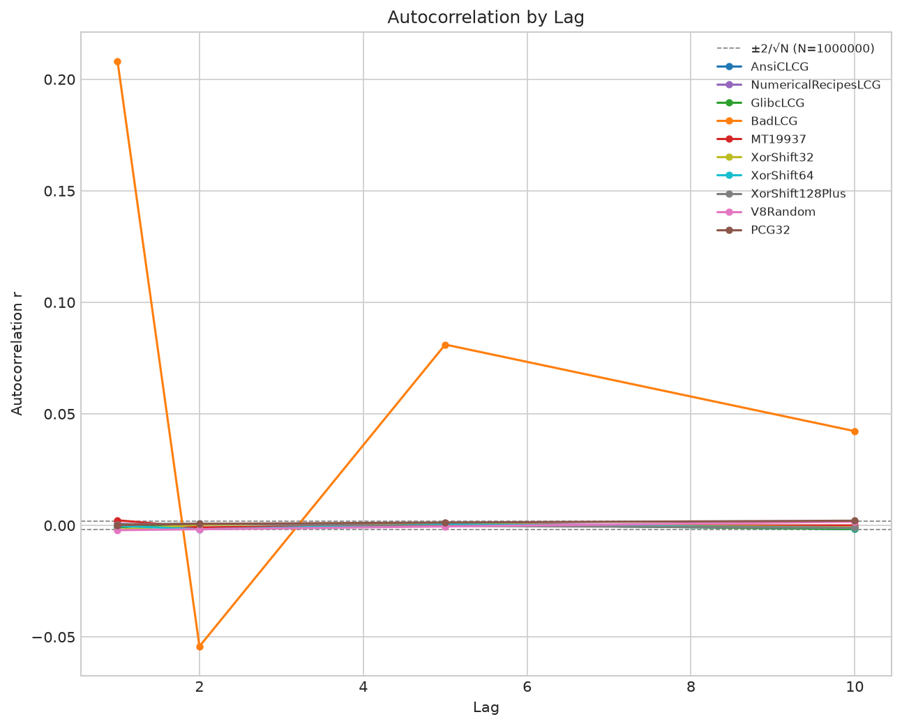
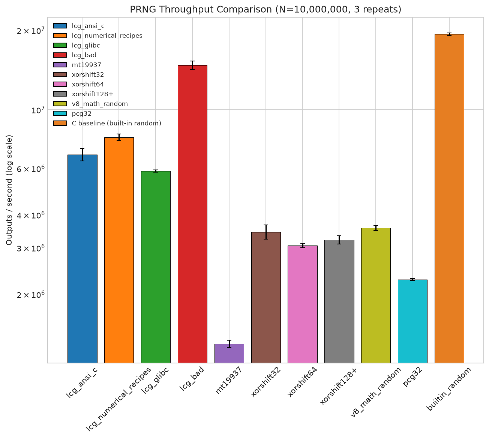
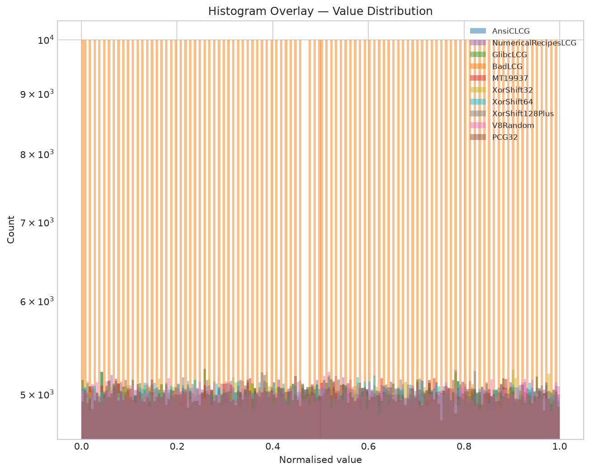
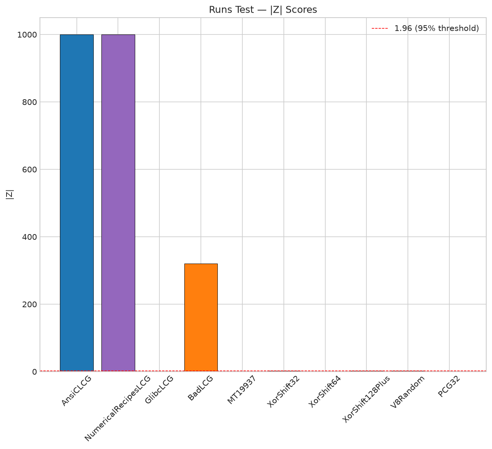
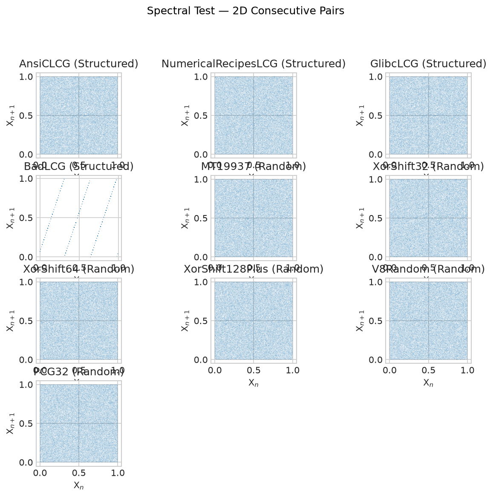

# PRNG Analysis Report

## 1. Environment
- Python: 3.12.3
- Platform: Linux-6.18.33.2-microsoft-standard-WSL2-x86_64-with-glibc2.39
- Generated: 2026-09-09 13:44:04

## 2. Generators Tested

- AnsiCLCG
- NumericalRecipesLCG
- GlibcLCG
- BadLCG
- MT19937
- XorShift32
- XorShift64
- XorShift128Plus
- V8Random
- PCG32

## 3. Statistical Test Results

| Generator | Chi2 p-val | Autocorr (lag1) | Runs Z | Spectral |
|---|---|---|---|---|
| AnsiCLCG | 0.9338 | -0.0008 | 999.9985 | visual (pass) |
| NumericalRecipesLCG | 0.2691 | 0.0009 | 999.9985 | visual (pass) |
| GlibcLCG | 0.0048 | -0.0008 | -0.0580 | visual (pass) |
| BadLCG | 0.0000 | 0.2082 | 320.5284 | visual (pass) |
| MT19937 | 0.5360 | 0.0023 | 1.4109 | visual (pass) |
| XorShift32 | 0.5813 | -0.0019 | -2.1729 | visual (pass) |
| XorShift64 | 0.1282 | -0.0001 | 1.2265 | visual (pass) |
| XorShift128Plus | 0.7675 | 0.0005 | -1.9917 | visual (pass) |
| V8Random | 0.5358 | -0.0021 | -1.9917 | visual (pass) |
| PCG32 | 0.5769 | 0.0002 | 0.6989 | visual (pass) |

## 4. Visualization

## 5. Attack Results

### LCG

- Parameters recovered: {a: 1103515245, c: 12345}
- Prediction accuracy: 100.0%
- Unknown-modulus recovered: {m: 101, a: 3, c: 7}
### MT19937
- State recovered: yes
- Prediction accuracy: 100.0%
### Xorshift
- xorshift32: state recovered via brute force, 100.0%
- xorshift64: state recovered, 100.0%
- V8 xorshift128+: state recovered via z3

## 6. Benchmark Results

| Generator | Mean (s) | Std (s) | Outputs/s |
|---|---|---|---|
| lcg_ansi_c | 1.4769 | 0.0803 | 6,770,763 |
| lcg_numerical_recipes | 1.2700 | 0.0359 | 7,874,087 |
| lcg_glibc | 1.7043 | 0.0156 | 5,867,617 |
| lcg_bad | 0.6776 | 0.0251 | 14,757,764 |
| mt19937 | 7.6954 | 0.2349 | 1,299,477 |
| xorshift32 | 2.9003 | 0.1798 | 3,447,866 |
| xorshift64 | 3.2652 | 0.0680 | 3,062,586 |
| xorshift128+ | 3.1073 | 0.1141 | 3,218,272 |
| v8_math_random | 2.7975 | 0.0649 | 3,574,592 |
| pcg32 | 4.3995 | 0.0396 | 2,273,009 |
| builtin_random | 0.5170 | 0.0058 | 19,342,683 |

## 7. Conclusions

- Statistical strength: passed all tests — XorShift64
- Statistical weakness: failed at least one test — AnsiCLCG, NumericalRecipesLCG, GlibcLCG, BadLCG, MT19937, XorShift32, XorShift128Plus, V8Random, PCG32
- Attack outcomes: fully recoverable / not cryptographically secure — lcg_known, lcg_unknown, mt19937, xorshift32, xorshift64, V8 xorshift128+
- Performance: fastest builtin_random, slowest mt19937
- C-vs-Python gap: built-in random ~1.3× faster than the fastest pure-Python generator.
